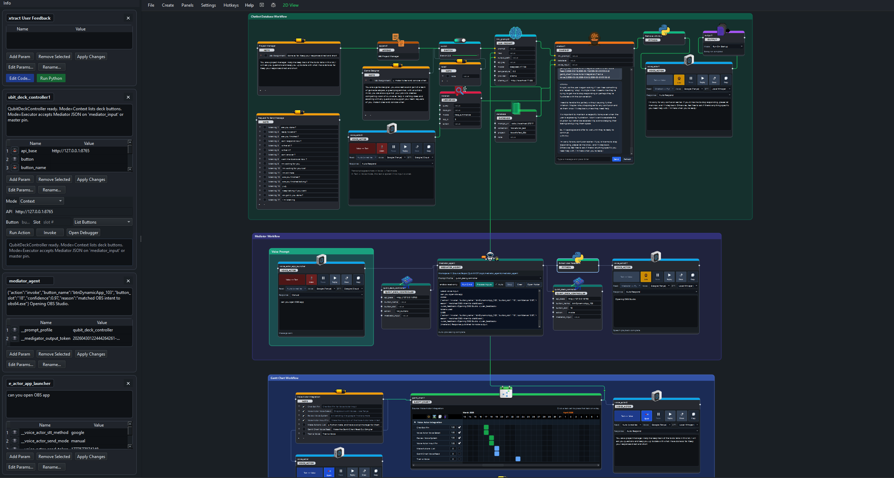
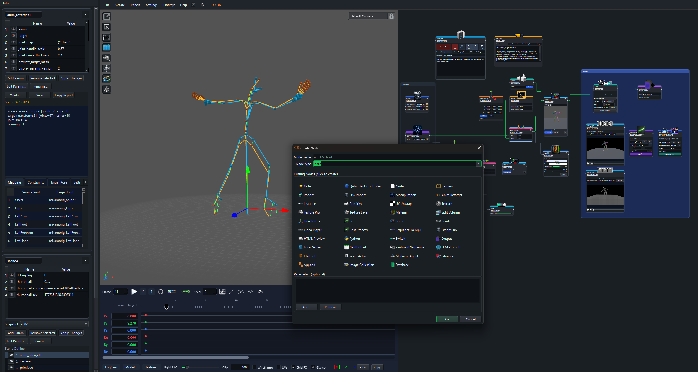

# QubitMCP

QubitMCP is a desktop Python app (Qt/PySide6) with supporting node and librarian components.

## Connect

[](https://quantality.com)
[](Doc/index.html)
[](mailto:quantalityfx@gmail.com)
[](https://discord.com/invite/zJSKYZYZ)
[](https://www.linkedin.com/in/ernesto-marrero-7760092a/)
[](https://www.instagram.com/vimpassion/)
[](https://www.youtube.com/@vimpassion)

## UI Examples

| AI Workflow | Animation Workflow |
| --- | --- |
|  |  |

## Requirements

1. Windows 10/11
2. Git
3. Python 3.x with `py` launcher available on PATH

## Quick Start (Recommended)

1. Clone the repository and open a terminal in the repo root.
2. Run:
```bat
setup.bat
```
3. Start the app (choose one):
With launcher batch:
```bat
Run_QubitMCP.bat
```
Or run the script directly:
```bat
.\.venv\Scripts\python.exe echograph_app.py
```

`setup.bat` prepares:
- `.venv` for the main app
- `nodes/librarian/.venv` for librarian dependencies

## Optional: Autodesk FBX SDK Runtime

For full FBX compatibility (beyond pyassimp fallback), install Autodesk FBX runtime files into the app venv.

In-app easiest path:

1. Create an `FBX Import` node.
2. Click `Install FBX Support` in the setup prompt.
3. The app will download Autodesk's installer, run it, auto-detect SDK files, and install runtime files into the app venv.

Official Windows FBX Python SDK installer:

`https://damassets.autodesk.net/content/dam/autodesk/www/files/fbx202039_fbxpythonsdk_win.exe`

Check status:

```powershell
powershell -NoProfile -ExecutionPolicy Bypass -File .\check_fbx_sdk.ps1
```

Install from a local SDK folder using either layout:

- `fbx-*.whl` + `FbxCommon.py`
- `fbx*.pyd` + `FbxCommon.py` (optional `libfbxsdk.dll`)

Then run:

```powershell
powershell -NoProfile -ExecutionPolicy Bypass -File .\install_fbx_sdk.ps1 -SourceDir "C:\path\to\fbx_runtime"
```

You can also wire this into setup:

```bat
setup.bat full "C:\path\to\fbx_runtime"
```

Or (for automation/non-interactive installs):

```bat
set FBX_SDK_SOURCE=C:\path\to\fbx_runtime
setup.bat
```

If you do not pass a path, `setup.bat` will now prompt for the FBX runtime folder when SDK check fails.

## Manual Run (Without Launcher .bat)

After `setup.bat` completes:

```bat
.\.venv\Scripts\python.exe echograph_app.py
```

## Troubleshooting

1. `setup.bat` fails with Python not found:
   Install Python 3 and ensure `py` or `python` is on PATH.
2. Pip install errors:
   Check internet/proxy/firewall settings, then rerun `setup.bat`.
3. Double-click launch gives no window:
   Run from terminal with `.\.venv\Scripts\python.exe echograph_app.py` to see errors.
